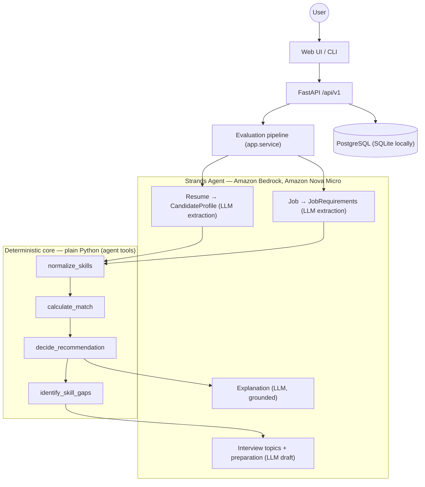

# CareerAgent

**Should you apply? Get an evidence-based answer, not generic advice.**

CareerAgent evaluates a resume against a job description and returns a
structured verdict — matched skills backed by verbatim resume evidence,
missing skills by severity, and a concrete preparation plan — with a
strict no-hallucination contract: nothing is ever claimed that the
resume cannot prove.

Built for the **Agents for Humans Hackathon**.

## Problem

Job descriptions are noisy. Candidates — especially early-career ones —
struggle to tell whether they are actually underqualified or simply
missing a small number of non-critical requirements. Generic career
chatbots make this worse: they produce plausible advice that isn't
anchored to the actual resume, so you still don't know what you're
really missing.

CareerAgent evaluates the candidate using **evidence from the resume**,
and nothing else. If the resume provides no evidence for something, the
system says *unknown* — it never guesses.

## Solution

Paste (or upload) a resume, paste a job description, press **Analyze**:

- a deterministic **APPLY / MAYBE / SKIP** recommendation with a match score;
- matched skills, each backed by **verbatim evidence quoted from the resume**
  (validated by code — invented evidence is dropped);
- missing requirements split by severity (critical / required / preferred),
  and requirements whose status the description leaves ambiguous kept as
  *unknown* (never guessed, never counted against the score);
- a **skill-gap preparation plan** and concrete **interview topics**;
- everything persisted so you can revisit past evaluations.

## Demo

The reproducible demo scenario lives in
[`docs/DEMO.md`](docs/DEMO.md) (< 3 minutes, one click via **Load
example**). Verified outcome of the demo inputs
(`examples/demo_resume.txt` + `examples/demo_job.txt`):

```text
Recommendation:   APPLY
Score:            80   (4 of 5 required skills)
Matched:          python, rest api, postgresql, docker
Missing required: aws            ← the gap, with a preparation plan
Missing preferred: ci/cd, kubernetes
Evidence:         5 verbatim quotes from the resume
```

Deliberately not a 100% match: the point of the product is showing
*exactly* what you're missing and how to close it — not cheerleading.

## How it works

**LLM interprets. Code decides. Evals verify.**

```text
Resume ──> LLM extraction ──> CandidateProfile   (Pydantic)
Job    ──> LLM extraction ──> JobRequirements    (Pydantic)
                    ↓
        Normalization (aliases, context words)
                    ↓
        Deterministic matching (score, evidence validation)
                    ↓
        Recommendation policy (centralized thresholds)
                    ↓
        Gap analysis (severity from code, content from LLM)
                    ↓
        Grounded explanation (LLM, from the computed result)
```

The LLM (Amazon Nova Micro) only does what a model should do: extract
structure from ambiguous text and draft explanation content. The
score, thresholds, severity ranking, and the APPLY/MAYBE/SKIP verdict
are 100% deterministic Python — the model cannot quietly change the
business rules.

## Architecture



The same evaluation core runs behind three runtimes — CLI, FastAPI +
web UI, and an Amazon Bedrock AgentCore Runtime adapter — without the
core ever depending on any of them.

**AgentCore status:** the runtime adapter, deployment package and docs
are implemented and validated locally, but the live deployment is
currently **blocked by IAM permissions** in our AWS account (no
`bedrock-agentcore-control`/S3 access) — see
[`docs/deploy/agentcore.md`](docs/deploy/agentcore.md). It is a
planned deployment, not an active production component.

## Why agentic?

The Strands agent works through **five tools** — an inspectable
workflow, not a single mega-prompt:

```text
Agent
 ├── analyze_job            (classify + normalize requirements)
 ├── normalize_skills       (canonical names for both sides)
 ├── calculate_match        (deterministic score + recommendation)
 ├── identify_skill_gaps    (severity: critical > required > preferred)
 └── generate_interview_plan (validate + assemble preparation)
```

Each step is deterministic where determinism is possible, individually
tested, and demoable. The agent's freedom is confined to interpretation
and drafting — never to the verdict.

## Tech stack

Python 3.11+ · Strands Agents SDK · Amazon Bedrock (Amazon Nova Micro)
· FastAPI · Pydantic · SQLAlchemy 2.0 + Alembic (SQLite/PostgreSQL)
· Docker · Nix flake · pytest · Ruff

## Features

- Resume input as pasted text, TXT, or **PDF** (validated: format,
  size, corrupt and scanned/image-only files rejected explicitly)
- Structured `EvaluationResult` contract across CLI, API and UI
- Skill **normalization**: aliases (`postgres` → `postgresql`,
  `cicd` → `ci/cd`, `cpp` → `c++`, `rest api development` →
  `rest api`) and context-word stripping (`AWS experience` → `aws`)
- Ambiguous requirements kept as `unknown` — never counted in the score
- Centralized recommendation policy (APPLY ≥ 70 with no critical miss
  and no experience mismatch; SKIP < 45 or critical miss; else MAYBE)
- Evaluation history in PostgreSQL/SQLite, migrations on boot
- OpenAPI docs, request validation, explicit error mapping
  (413/415/422/502), structured logging
- Two-tier eval suite (see below)

## Evaluation

Results from a concrete execution — **2026-09-01, Amazon Nova Micro
(`amazon.nova-micro-v1:0`), temperature 0.2, 25 cases, us-east-1** —
not eternally hardcoded numbers. Re-run with `make eval` /
`make eval-llm`:

```text
Deterministic tier (no LLM, reproducible)
Correct recommendation:      100% (25/25)
Match exactness:             100% (25/25)
Requirement classification:  100% (25/25)
Evidence grounding:          100% (25/25)
Evidence hallucination:        0 fabricated items kept

LLM tier (real Bedrock extraction)
Skill recall / precision:  97.2% / 97.2%
Years extraction:          100% (25/25)
Requirement classification:  84% (21/25)
Recommendation correctness:  92% (23/25)
Evidence hallucination:       0%  ← critical target, met in every run
Tool invocation:            100% (3/3 agent loops, all 5 tools)
```

The eval suite ([`tests/evals/`](tests/evals/)) covers 25 cases in 8
categories: strong/weak match, missing required/preferred skills,
junior-vs-senior experience gates, ambiguous requirements, skill
aliases, irrelevant experience. Cases include **hallucination probes**
— plausible-but-absent resume claims that the evidence validator must
drop.

Two tiers, deliberately separated for cost:

- `make test` and `make eval` **never call Bedrock** — the
  deterministic tier runs free in CI, and the dataset integrity plus
  the full deterministic tier are part of the normal test suite.
- `make eval-llm` makes real model calls (~50 on Nova Micro) and must
  be run explicitly.

Only metrics actually executed are reported (`dist/evals/report.md`,
timestamped). Across repeated executions at temperature 0.2 we observe
run-to-run variance: recommendation correctness 84–92%, requirement
classification 68–88%, while **fabricated evidence remained 0 in every
execution**.

## Quick start

```bash
python3.11 -m venv .venv && source .venv/bin/activate
make dev          # install with dev extras
aws configure     # credentials with Bedrock access (Nova Micro)
make run          # http://127.0.0.1:8000/  → Load example → Analyze
```

## AWS setup

CareerAgent talks to Amazon Bedrock through the Strands SDK using the
default AWS credential chain — no keys in the repo, no keys in `.env`
(see `.env.example`). Configure any standard mechanism:

```bash
aws configure     # or SSO, or environment variables in your shell
```

Optional environment variables (defaults in parentheses):
`AWS_REGION` (`us-east-1`), `BEDROCK_MODEL_ID`
(`amazon.nova-micro-v1:0`), `BEDROCK_TEMPERATURE` (`0.2`).

We deliberately develop and demo on **Nova Micro, the cheapest Bedrock
model**, and fixed extraction quirks in a deterministic normalization
layer instead of upgrading the model.

## Running locally

With Nix:

```bash
nix develop
python -m venv .venv && source .venv/bin/activate
make dev
```

Without Nix (Python 3.11+ required — use the `python3.11` binary
explicitly if your default `python3` is older):

```bash
python3.11 -m venv .venv
source .venv/bin/activate
python -m pip install --upgrade pip
make dev
```

The deterministic layer needs no LLM and is the fastest smoke check:

```bash
make test
```

### CLI

```bash
make cli                                  # demo pair: examples/demo_*.txt
python -m app.cli cv.pdf job.txt          # real files (PDF or TXT)
python -m app.cli --chat                  # Strands agent, 5-tool free loop
```

### Web UI / API

```bash
make run                                  # UI on :8000, docs on /docs
```

Text and upload endpoints (stable `/api/v1` contract):

```bash
curl -X POST http://127.0.0.1:8000/api/v1/evaluations \
  -H 'content-type: application/json' \
  -d '{"resume_text": "...", "job_description": "..."}'

curl -X POST http://127.0.0.1:8000/api/v1/evaluations/upload \
  -F 'resume=@cv.pdf' \
  -F 'job_description=Junior backend engineer. Requires Python.'
```

Responses are structured `EvaluationResult` JSON — recommendation,
score, matched/missing skills by severity, verbatim evidence,
strengths, skill gaps with preparation steps, interview topics, and
reasoning. Errors are explicit: `422` invalid payload/empty or
unreadable inputs, `413` too large, `415` unsupported format, `502`
model failure.

### Persistence

Every evaluation is stored (`Candidate → Resume`, `Resume + Job →
Evaluation`): score, recommendation, skill lists, evidence, gaps,
timestamps — never internal prompts. Selected by `DATABASE_URL`
(default zero-config SQLite; PostgreSQL via docker compose). Alembic
owns the schema and migrations run automatically on API startup, or:

```bash
make migrate
curl http://127.0.0.1:8000/api/v1/evaluations        # history
curl http://127.0.0.1:8000/api/v1/evaluations/1      # stored evaluation
```

## Docker

```bash
make docker-build && make docker-run      # single container (SQLite)
make compose-up                           # API + PostgreSQL
make compose-down
```

`docker compose` starts PostgreSQL and the API (migrations on boot,
data persists in the `pgdata` volume) and mounts your `~/.aws`
credentials read-only for Bedrock access. Verified end-to-end from a
clean build: health check, UI, a real Bedrock evaluation, persistence
and history.

## Tests

```bash
make test      # 219 tests, no LLM calls (models mocked where relevant)
make lint      # ruff
```

## Security / privacy

- Resumes contain **PII**. CareerAgent is a hackathon project, **not a
  production service** — production use would need access controls,
  retention limits and encryption decisions we have not built.
- Logs record input sizes and stage timings, **never full resumes or
  full prompts**; the database stores resume/job text but no internal
  prompts.
- No secrets in the repo: AWS credentials come from the standard
  credential chain (never committed, never in `.env`); `.env.example`
  documents variables without real values.
- All dynamic content in the web UI is rendered XSS-safe via
  `textContent`/`createElement`.

## Limitations

Honest ones:

- **LLM run-to-run variance** at temperature 0.2 — recommendation
  correctness ranged 84–92% across our executions.
- **Nova Micro struggles with ambiguous requirements**: prose mentions
  ("you will work with Kubernetes") are sometimes classified as
  required instead of unknown, and items are occasionally dropped from
  explicit requirements lists. This is the dominant residual error mode.
- The alias map covers observed high-frequency variants only — it is
  not a complete skills ontology.
- Requirement classification is not perfect (68–88% strict
  all-buckets-exact across runs); the *recommendation* is more stable
  than the *classification* because normalization and policy absorb
  part of the noise.
- A recommendation is decision support, not a decision — candidates
  should still read the job posting.
- PDF parsing works for text-based PDFs; scanned/image-only PDFs are
  detected and rejected, not OCR'd.
- The AgentCore deployment is blocked by IAM permissions in our AWS
  account (documented in `docs/deploy/agentcore.md`); we do not claim a
  deployed endpoint.

## Roadmap

Versioned progress v0.1 → v1.0 lives in
[`docs/ROADMAP.md`](docs/ROADMAP.md). Post-hackathon ideas (job search,
ranking, resume adaptation, application tracking) are explicitly listed
there as *not built*.

## Hackathon

- Demo scenario & script: [`docs/DEMO.md`](docs/DEMO.md)
- Video script: [`docs/VIDEO_SCRIPT.md`](docs/VIDEO_SCRIPT.md)
- Devpost draft: [`docs/DEVPOST.md`](docs/DEVPOST.md)
- Required screenshots: [`docs/screenshots/`](docs/screenshots/) — to be
  captured from the running app (none are fabricated)

## License

Apache-2.0 — see [LICENSE](LICENSE).
